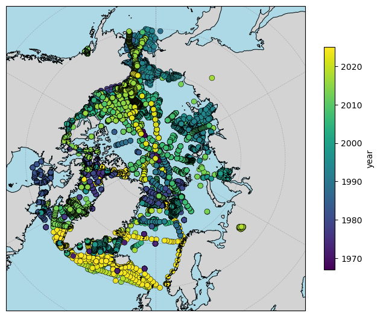

## Data

### Dataset description

The dataset is a collation of observations from a variety of campaigns from 1961 to the present day. Due to the historical nature of the data, not all values are present, particularly for early cruises.

Early observations were made using bottles. More recently, observations are made using CTDs, which measure **c**onductivity, **t**emperature and **d**epth.

The training dataset are provided as CSV files with [XXX] rows and 31 columns. Each row contains a single  $\delta^{18}$O measurement and all available metadata. A description of each column, including units and parameter notes, are found in the associated `dataset_schema.csv` files. Not all metadata is available for each data point. 

#### Files

- `train.csv`
- `test.csv`
- `dataset_schema.csv`

#### Columns
- `id`
- `Sample_Date` - the date of the observation.
- `Time` - the time (in UTC?), not available for all observations.
- `Latitude` - degrees north where the observation was made.
- `Longitude` - degrees east where the observations was made.
- `Temperature` - observed temperature. 
- `CTD_Pressure` - observed pressure.
- `Depth_From_Pressure` - calculated depth in metres from the observed pressure.
- `DELO18` - Oxygen-18 isotope content.
- `CTD_Salinity` - calculated salinity from the CTD.
- `Bottle_Salinity` - calculated salinity from a bottle sample.
